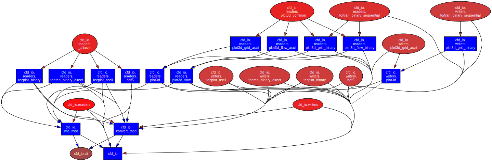

# Package Architecture

Visual overview of the `cfd_io` module structure and data flow.

## Module Dependency Graph



[Download architecture (SVG)](../assets/architecture.svg){ .md-button download="cfd_io_architecture.svg" }
[View in browser](../assets/architecture.svg){ .md-button target="_blank" }

??? info "Regenerate"

    ```bash
    pydeps src/cfd_io --noshow --max-bacon=4 --cluster -o docs/assets/architecture.svg
    ```

## Data Flow

All readers return the same three-dict tuple, and all writers accept it:

```
read_file(path)  →  (grid_dict, flow_dict, attrs_dict)  →  write_file(path, ...)
```

| Dict | Contents | Example keys |
|------|----------|-------------|
| `grid_dict` | Coordinate arrays | `"x"`, `"y"`, `"z"` |
| `flow_dict` | Solution variables | `"rho"`, `"u"`, `"v"`, `"w"`, `"p"` |
| `attrs_dict` | Metadata | `"mach"`, `"re"`, `"nx"`, `"ny"`, `"nz"` |

## Format Dispatch

`read_file` and `write_file` resolve the file format from the extension:

| Extension | Format | Reader | Writer |
|-----------|--------|--------|--------|
| `.h5`, `.hdf5` | HDF5 | `read_hdf5` | `write_hdf5` |
| `.x`, `.xyz` | Plot3D grid | `read_plot3d` | `write_plot3d` |
| `.q` | Plot3D solution | `read_plot3d_flow` | — |
| `.dat` | Tecplot ASCII | `read_tecplot_ascii` | `write_tecplot_ascii` |
| `.plt` | Tecplot binary | `read_tecplot_plt` | `write_tecplot_plt` |
| `.s8`, `.s4` | Raw binary (split) | `read_binary_direct` | `write_binary_direct` |
